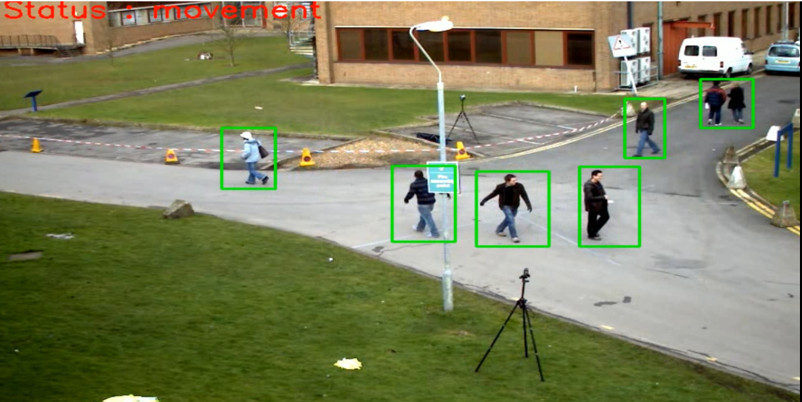

# MOVEMENT_DETECTION
This is a small project in computer vision using opencv library and python to detect moving objects in a video.

#HOW TO USE
just replace the video name in code (vtest.avi) with your video name and if does't work as expected try changing (contourArea < 700) the 700 to little more or less as per your video and it will work smoothly.
